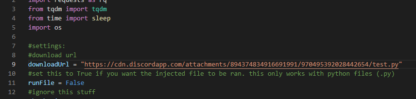
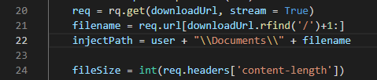
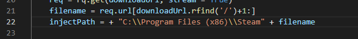

# python Injector

very simple python script that allows you to inject a file into someones computer to a specified path and run it

## How To Use
 
 1. go to the release tab and download the zip folder and extract it. Install all the dependencies too.
 2. open up Notepad or any text editor. In this case, im using Visual Studio Code
 3. open up "main.py" in your text editor and go to line 9. Replace DOWNLOAD_LINK to your download link. View the example below
 
 4. go to line 11. If you are injecting a python file and want it to be ran, set this to True. Otherwise, leave it false
 5. look at line 22. here you will add the path you want the file injected to in the quotations. Leave out the filename as they are already covered and make sure to add an extra backslash to the path. you can also add user + to the beginning if you want to add C:\Users\username to the beginning of the path. Here is an example:
   
  
  
  in this case, the full path will be C:\Users\usernameofpcuser\documents\nameoftheinjectedfile
  
  here is another example:
  
  
  
  In this case, the full path will be C:\Program Files (x86)\Steam\nameoftheinjectedfile

  6. if you want to compile the code into an executable, open up command prompt in the current directory and type: `pyinstaller --clean --onefile --noconsole -i NONE main.py`
  

 